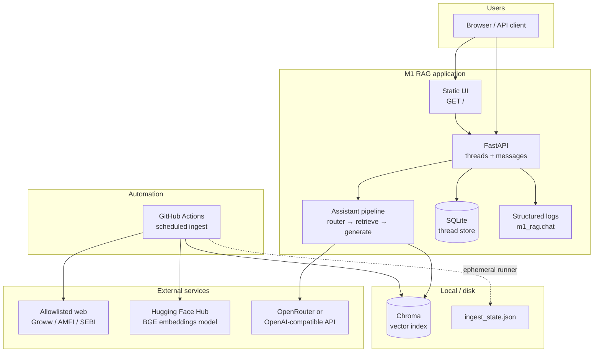
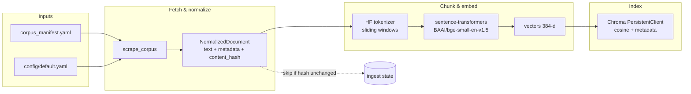
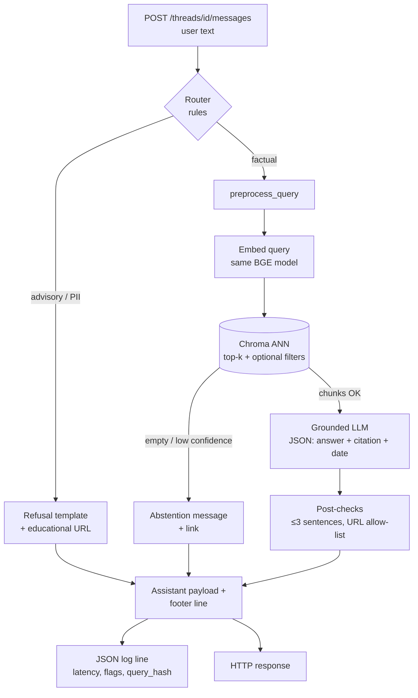
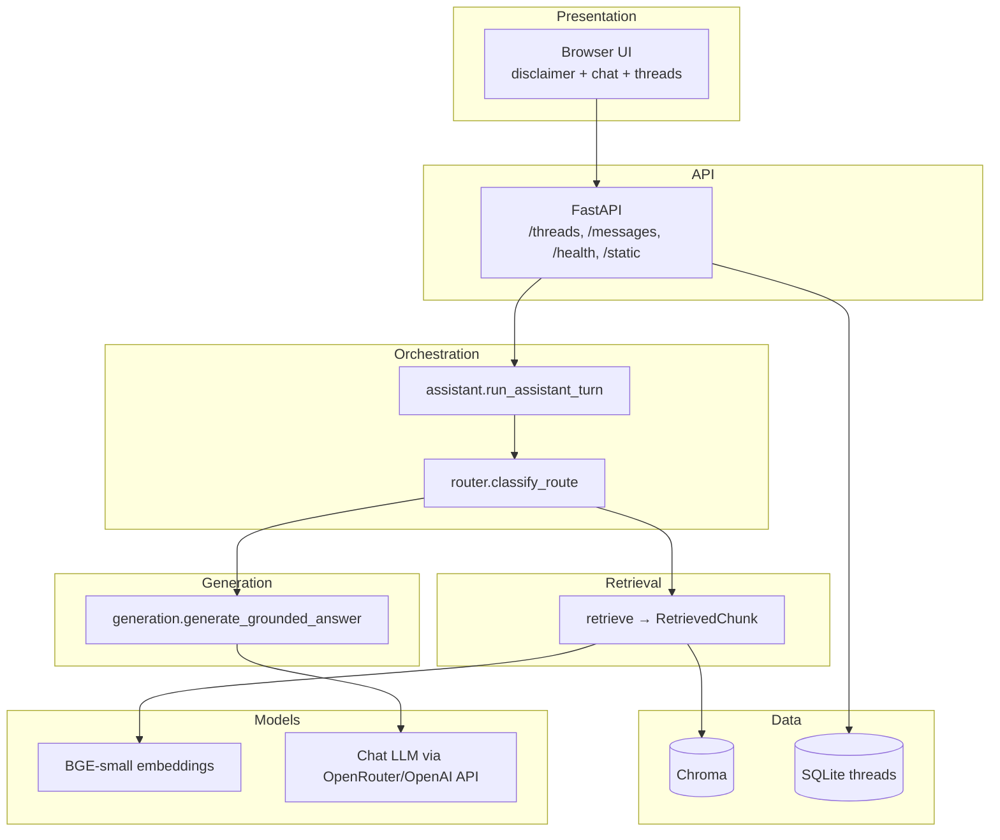
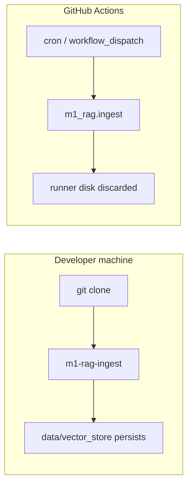

# M1 RAG — High-level architecture (diagrams)

Pictorial view of the **facts-only mutual fund FAQ assistant**. For narrative detail, see [rag-architecture.md](./rag-architecture.md) and [chunking-embedding-architecture.md](./chunking-embedding-architecture.md).

---

## 1. System context (who talks to what)

Boxes show major deployable pieces and external systems.



---

## 2. Ingestion pipeline (offline / batch)

Flow from manifest URLs to searchable vectors.



**CLI:** `m1-rag-ingest` · **Scheduler:** GitHub Actions cron (same command on a runner; index on runner is usually not persisted unless you add artifacts/deploy).

---

## 3. Query path (online / one user turn)

From HTTP message to answer JSON (and UI).



**Secrets:** LLM key via `.env` (`M1_RAG_OPENROUTER_API_KEY` or `M1_RAG_LLM_API_KEY`). Embeddings run **locally** by default (no embedding API key).

---

## 4. Layered view (logical architecture)

Stacked responsibilities—useful for slides.



---

## 5. Automation vs local dev (two ways to run ingest)



---

## 6. ASCII overview (quick sketch)

```
┌──────────────────────────────────────────────────────────────────────────┐
│                           BROWSER (Phase 8 UI)                            │
│                 disclaimer · examples · chat · threads                  │
└─────────────────────────────────┬────────────────────────────────────────┘
                                  │ HTTP
┌─────────────────────────────────▼────────────────────────────────────────┐
│                         FastAPI (Phase 7)                                 │
│   GET /  GET /health  POST /threads  POST /threads/{id}/messages         │
│   logs: JSON lines (Phase 9) · thread rows in SQLite                      │
└─────────────────────────────────┬────────────────────────────────────────┘
                                  │
        ┌─────────────────────────┼─────────────────────────┐
        │                         │                         │
        ▼                         ▼                         ▼
 ┌─────────────┐           ┌─────────────┐           ┌─────────────┐
 │   Router    │           │  Retrieval  │           │  Refusal    │
 │  (Phase 6)  │           │  (Phase 5)  │           │  templates  │
 └──────┬──────┘           └──────┬──────┘           └─────────────┘
        │                         │
        │                    ┌──────▼──────┐
        │                    │  Chroma    │
        │                    │  + BGE     │
        │                    │  embed q   │
        │                    └──────┬──────┘
        │                           │
        └───────────────────────────┼──────────────────────┐
                                    ▼                      │
                             ┌─────────────┐               │
                             │ Chat LLM    │◄── OpenRouter │
                             │ JSON answer │    / OpenAI   │
                             └─────────────┘               │
                                                           │
┌──────────────────────────────────────────────────────────┴───────────────┐
│ INGEST (manual CLI or GitHub Actions cron)                               │
│  manifest → scrape → normalize → chunk → embed (BGE) → upsert → Chroma  │
└──────────────────────────────────────────────────────────────────────────┘
```

---

## 7. Rendering these diagrams

- **GitHub:** This file renders Mermaid in the web UI when viewed in the repo.
- **VS Code / Cursor:** Use a Mermaid preview extension, or paste into [mermaid.live](https://mermaid.live).
- **Export PNG/SVG:** Use Mermaid CLI or mermaid.live **Actions → PNG/SVG**.
- **Pre-rendered PNG (all sections):** [docs/diagrams/m1-rag-hld-full.png](./diagrams/m1-rag-hld-full.png) — vertical stack of figures 1–5; individual exports live beside it as `01-system-context.png` … `05-automation-local.png` (sources under [docs/diagrams/sources](./diagrams/sources/)).

---

## Document history

| Version | Description |
|---------|-------------|
| 1.0 | High-level box/flow diagrams for M1 RAG |
