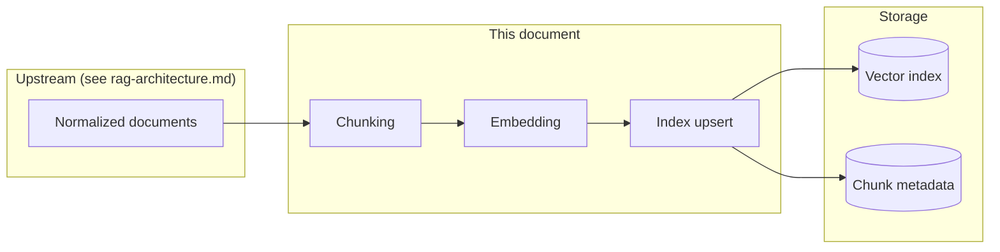

# Chunking & Embedding Architecture

This document specifies **how** normalized documents from the scraping pipeline are turned into **searchable vector records**. It complements the system view in [rag-architecture.md](./rag-architecture.md) and assumes upstream steps: allowlisted fetch, HTML/PDF normalization, and per-document metadata (`source_url`, `document_type`, `fetched_at`, `content_hash`).

---

## 1. Position in the ingestion pipeline



**Contract in**: Each normalized document is a UTF-8 text string (or page-ordered text for PDFs) plus document-level fields. No PII is expected in corpus text.

**Contract out**: The vector index contains one row per **chunk**, each with a dense embedding, stable `chunk_id`, and joinable metadata for filtering and citations.

---

## 2. Chunking architecture

### 2.1 Goals

- Split long factsheets and SIDs into segments that fit the embedding model’s limits and match **user question granularity** (e.g., “exit load”, “minimum SIP”).
- Preserve **retrieval precision**: chunks should not mix unrelated schemes or unrelated sections where avoidable.
- Keep **overlap** so boundary answers (e.g., metric at end of one section and start of next) still retrieve.

### 2.2 Unit of work

| Input | Description |
|-------|-------------|
| `doc_id` | Stable ID per logical document (e.g., hash of canonical `source_url` + `document_type`). |
| `text` | Full normalized body after HTML/PDF extraction. |
| `source_url` | Citation URL for the document (redirects resolved). |
| `document_type` | `factsheet` \| `kim` \| `sid` \| `faq` \| `regulatory` \| `hub_page` |
| `scheme_name` / `amc` | Optional; from parsing or config. |
| `page_boundaries` | Optional: list of `(start_char, end_char)` for PDFs to avoid splitting mid-table when possible. |

### 2.3 Pre-processing before splits

1. **Unicode normalize** (NFC), collapse excessive whitespace, preserve single newlines where they separate list items.
2. **Detect structure**:
   - **HTML-derived**: retain heading levels if preserved as markdown-style `#` / `##` or as known patterns (“Expense ratio”, “Exit load”).
   - **PDF-derived**: regex / heuristics for ALL CAPS headings, numbered sections, or TOC lines.
3. **Optional**: Map known MF section labels to tags (e.g., `section:exit_load`) for metadata—helps filters, not required for v1.

### 2.4 Splitting strategy (recommended order)

1. **Primary split — structure-aware**  
   Split on **major headings** first (H1/H2 or PDF section titles). Each top-level section becomes a **segment** for further splitting.

2. **Secondary split — length-aware**  
   Within a segment, apply a **recursive character/text splitter** with:
   - **Target size**: 400–800 **tokens** (use the **same Hugging Face tokenizer** as the embedding checkpoint — in this repo `chunking.tokenizer_model_id` matches **`BAAI/bge-small-en-v1.5`** so chunk boundaries align with the embedder’s tokenization).
   - **Overlap**: 50–120 tokens between consecutive chunks so cross-boundary facts appear in at least one chunk.
   - **Separators** (try in order): `\n\n`, `\n`, `. `, ` ` — so splits prefer paragraph boundaries.

3. **Hard limits**  
   - Never exceed the embedding model’s **max input tokens** (leave margin for batching overhead).
   - If a single table or paragraph exceeds the limit, split mid-block as last resort and duplicate a one-line **context prefix** (e.g., scheme name) into the chunk text payload for embedding only.

### 2.5 Chunk record schema (per chunk)

Each chunk is assigned:

| Field | Description |
|-------|-------------|
| `chunk_id` | Globally unique: e.g. `{doc_id}:{ordinal}` or UUIDv5 from `(doc_id, start_offset, end_offset)`. |
| `doc_id` | Parent document. |
| `text` | The substring (or augmented text) sent to the embedder. |
| `start_offset` / `end_offset` | Character offsets into normalized `text` for audit (optional but useful). |
| `chunk_index` | 0-based order within document. |
| `section_heading` | Best-effort title of the enclosing section. |
| `source_url` | Copied from document (citation root). |
| `document_type`, `scheme_name`, `amc` | Copied for filters. |
| `content_hash` | Parent document hash at ingest time. |
| `embedded_at` | ISO timestamp when this vector was written. |

### 2.6 De-duplication and stability

- **Within document**: If two adjacent splits produce identical `text` after normalization, merge or drop duplicate.
- **Across runs**: If `content_hash` for `doc_id` is unchanged, **skip re-chunking and re-embedding** for that document (saves API cost). If hash changed, **delete** old `chunk_id` rows for `doc_id` then insert new ones (transactional upsert).

### 2.7 Optional: lexical index in parallel

If hybrid search is used, emit the same `chunk_id` and `text` to a **BM25** index builder in the same job so dense and sparse indices stay aligned.

---

## 3. Embedding architecture

### 3.1 Goals

- **One embedding model** for both ingestion and query-time retrieval (same model ID and dimension).
- **Deterministic batches** and stable ordering for local inference (CPU/GPU); optional retries/rate limits if you swap in a hosted API later.
- **Cost control**: skip unchanged documents via `content_hash`; batch chunks according to `embedding.batch_size` and available RAM/VRAM.

### 3.2 Model selection (constraints)

- **Default checkpoint**: **`BAAI/bge-small-en-v1.5`** ([sentence-transformers](https://www.sbert.net/) / Hugging Face) — **384 dimensions**, English-friendly, strong retrieval quality at small footprint.
- **English + financial numerals**: Documented **max sequence length** (512 tokens for this model); keep `chunk_size_tokens` within that budget with margin.
- **Version pinning**: Store `embedding_model_id` and `embedding_model_version` on each vector row or in deployment config so re-indexing can be forced when the model changes.

### 3.3 Embedding procedure

1. **Input**: List of chunk `text` strings (after chunking). Truncate or error if any chunk still exceeds model limits.
2. **Batching**: Group chunks into batches of at most `embedding.batch_size`. Preserve **ordering** so `chunk_id` ↔ vector alignment is stable when unbatching.
3. **Inference** (implemented): Load **`BAAI/bge-small-en-v1.5`** once, run `encode` on CPU or `embedding.device` (e.g. `cuda:0`) with **L2-normalized** outputs for cosine distance in Chroma.
4. **Output**: For each chunk, a float vector of length **384**.
5. **Validation**: Reject NaNs; normalization matches Chroma’s cosine space (unit vectors after encode).

### 3.4 Storage shape (vector DB row)

| Field | Type | Notes |
|-------|------|--------|
| `chunk_id` | string | Primary key |
| `embedding` | float[] | Dense vector |
| `source_url` | string | Citation |
| `document_type` | string | Filter |
| `scheme_name`, `amc` | string, optional | Filter |
| `content_hash` | string | Invalidation |
| `embedding_model_id` | string | Lineage |
| `fetched_at` | datetime | From parent document |
| `embedded_at` | datetime | This run |

Indexes: vector index on `embedding`; btree on `doc_id`, `source_url`, `scheme_name` as needed for pre-filtering.

### 3.5 Query-time symmetry

- User query string → **same embedder** → query vector → ANN search (e.g., HNSW) with optional metadata filters.
- No separate “mini” model for queries unless the product explicitly uses asymmetric retrieval (not assumed here).

---

## 4. End-to-end job orchestration (with GitHub Actions)

The **scheduled workflow** (see [rag-architecture.md §2.1](./rag-architecture.md)) should run a single pipeline script or container that:

1. Runs **scraping + normalization** (outputs normalized documents + hashes).
2. For each document, **chunk** → **embed** → **upsert** (with delete-stale for changed `doc_id`).
3. Exits non-zero if critical steps fail; partial success can be policy-defined (e.g., ≥90% URLs OK).

Chunking and embedding are **CPU/GPU-bound** (default local model); the workflow should:

- **No embedding API key** for the stock `bge-small-en-v1.5` path — models download from Hugging Face on first use (optionally cache `HF_HOME` / `TRANSFORMERS_CACHE` in CI).
- Cache **dependency layers** (pip/npm) to speed runs.
- Set **timeouts** longer than worst-case first-time model download + embed batch (e.g., 30–90 minutes for small corpus on cold CI).

### 4.1 Example schedule trigger (UTC)

GitHub Actions `schedule` is **UTC-only**. For **09:15 IST** use **`45 3 * * *`** (03:45 UTC). Illustrative fragment:

```yaml
on:
  schedule:
    - cron: "45 3 * * *" # 09:15 Asia/Kolkata (no DST)
  workflow_dispatch: {} # optional manual re-index

jobs:
  ingest:
    runs-on: ubuntu-latest
    timeout-minutes: 90
    steps:
      - uses: actions/checkout@v4
      - name: Run ingestion pipeline
        run: python -m m1_rag.ingest # scrape → normalize → chunk → embed → upsert
```

---

## 5. Observability

- Log per run: document count, chunk count, skipped (unchanged hash), embedded count, failures, total tokens estimated, wall-clock.
- Alert if **chunk count** drops sharply vs. previous run (possible scrape regression).

---

## 6. Summary

| Stage | Responsibility |
|-------|----------------|
| **Chunking** | Structure-first splits, token limits, overlap, stable `chunk_id`, dedupe, skip if `content_hash` unchanged |
| **Embedding** | Same model as queries, batched local `encode`, store model id + timestamps |
| **Index** | Upsert vectors + metadata; delete superseded chunks when document content changes |

---

## Document history

| Version | Description |
|---------|-------------|
| 1.0 | Initial chunking & embedding architecture |
| 1.1 | Default embedder `BAAI/bge-small-en-v1.5` (384-d, sentence-transformers); HF-aligned chunk tokenization |
