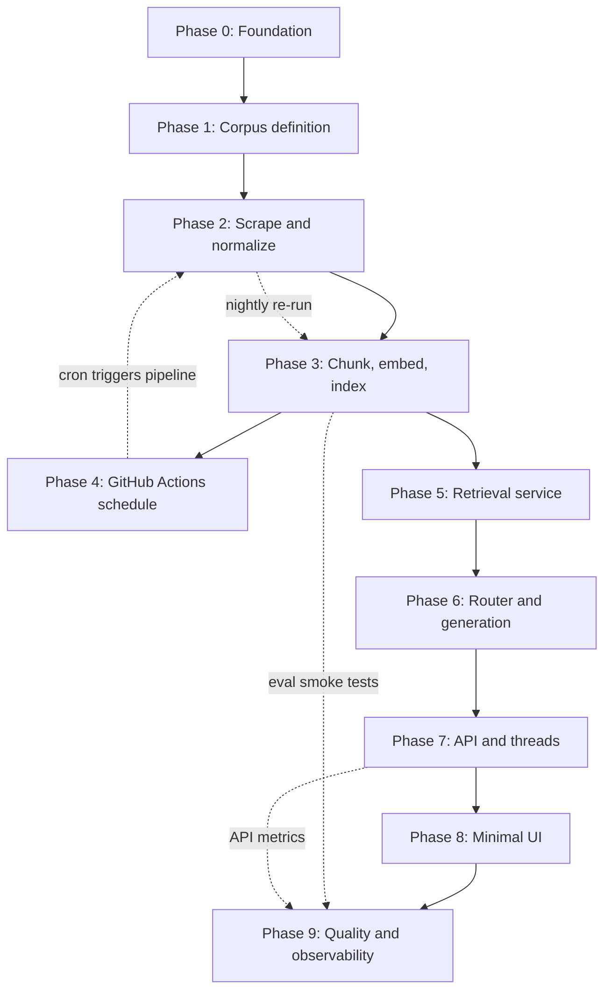
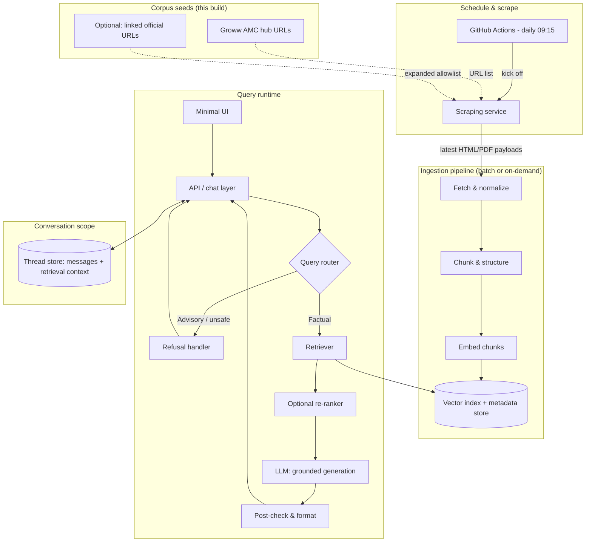

# RAG Architecture: Facts-Only Mutual Fund FAQ Assistant

This document describes the retrieval-augmented generation (RAG) architecture for the mutual fund FAQ assistant defined in [problemStatement.md](./problemStatement.md). The design prioritizes **accuracy, source traceability, and compliance** over conversational richness.

**Related**: [Chunking & embedding architecture](./chunking-embedding-architecture.md) — detailed design for splitting normalized text, generating embeddings, and writing the vector index. **Diagrams**: [High-level box & flowchart diagrams](./architecture-high-level-diagram.md).

---

## 1. Design Principles

| Principle | Implementation |
|-----------|----------------|
| Facts-only | Retrieval constrained to a curated corpus; generation prompts forbid advice and comparisons |
| Verifiability | Every answer cites exactly one source URL (from the curated corpus); optional “last updated” from ingestion metadata |
| Lightweight | Small corpus (15–25 URLs), modest embedding/index footprint, simple serving path |
| Privacy | No PII in prompts, logs, or storage; session/thread IDs only if needed for multi-chat |
| Transparency | Fixed response shape: short text + single citation + footer date |

---

## 2. Phase-wise architecture

Delivery is organized into **phases** that build from **data and indexing** toward **query serving**, **product UI**, and **operations**. Phases **0–4** are offline ingestion; **5–6** are the RAG core; **7–8** expose the assistant; **9** hardens quality and monitoring. Later phases assume earlier ones are complete unless noted.

### 2.1 Phase dependency overview

**Reading the diagram**: **Phase 4** wires automation (scheduled workflow) back into **Phase 2–3**. **Phase 9** spans logging, tests, and alerts and can start once **Phase 3** (index) and **Phase 7** (API) exist in draft form.

### 2.2 Phase summary

| Phase | Name | Scope | Primary deliverables |
|-------|------|--------|----------------------|
| **0** | Foundation | Tooling, config, secrets policy | Locked runtime/deps; config schema for allowlist, embedding model ID, vector DB; GitHub Secrets for LLM when used (`LLM_API_KEY`); optional API keys only where a hosted provider is wired; no keys in repo |
| **1** | Corpus definition | What URLs exist and how expansion works | Frozen list of five Groww AMC hubs ([§4.1](#41-corpus-scope-this-project)); manifest of expanded URLs (15–25+); rules for link-following, scheme category diversity; AMFI/SEBI seed URLs if used |
| **2** | Scrape and normalize | Pull and clean web/PDF content | Scraping module: allowlist enforcement, throttling, `User-Agent`, per-URL errors; normalized documents with `source_url`, `document_type`, `fetched_at`, `content_hash` ([§3.2](#32-scraping-service), [§4.2](#42-fetching-and-normalization)) |
| **3** | Chunk, embed, index | Searchable vectors | Pipeline per [chunking-embedding-architecture.md](./chunking-embedding-architecture.md): chunking, embedding batches, vector upserts, delete-stale on hash change; optional BM25; smoke tests (embed query → plausible neighbors) |
| **4** | GitHub Actions schedule | Daily 09:15 IST automation | Workflow: `on.schedule` UTC cron, `workflow_dispatch`; runs same entrypoint as manual ingest; job summary / failure visibility ([§3.1](#31-scheduler-service-github-actions)) |
| **5** | Retrieval service | Query-time search over index | Query embedding (same model as ingest); top-k ANN; optional metadata filters, hybrid fusion, re-ranker; low-confidence signal for abstention ([§5](#5-retrieval-layer)) |
| **6** | Router and generation | Safety and grounded answers | Advisory vs factual routing; refusal copy + educational link; grounded LLM prompts; JSON or structured output: ≤3 sentences, one `citation_url`, `last_updated` ([§6](#6-generation-layer-grounded-llm), [§7](#7-query-router--refusal-handling)) |
| **7** | API and threads | Backend contract | `POST /threads`, `POST /threads/{id}/messages`; `thread_id` isolation; no PII endpoints ([§8](#8-multi-thread--multi-chat-support), [§9](#9-api--ui-boundaries)) |
| **8** | Minimal UI | Problem-statement UX | Welcome, three example questions, disclaimer **“Facts-only. No investment advice.”**, one source link + footer per reply; multi-thread UI if required ([§9.2](#92-minimal-ui-problem-statement)) |
| **9** | Quality and observability | Confidence in production | Structured logs (no PII); golden Q&A + refusal tests; regression on re-ingest; alerts on scrape/embed failures or index lag ([§10](#10-observability-quality-and-safety)) |

### 2.3 Phase details

#### Phase 0 — Foundation

- Fix language/runtime versions and reproducible installs (lockfile).
- Define **configuration** as data: allowed hosts/paths, embedding model name/version, vector collection name, retrieval `top_k` defaults.
- **Secrets**: store API keys only in GitHub Actions / deployment environment; document required secret names for Phase 4.
- Optional: container image for ingest + API for parity between CI and production.

**Repository mapping (implemented)**: [`phases/phase_0_foundation/`](../phases/phase_0_foundation/README.md) indexes deliverables; `config/default.yaml` holds allowlist and model/vector/retrieval defaults; `src/m1_rag/settings.py` loads YAML + `M1_RAG_*` env vars; `.env.example` and `SECRETS.md` document keys; `requirements.lock` pins dependencies; optional [`Dockerfile`](../Dockerfile) at repo root.

#### Phase 1 — Corpus definition

- Treat corpus as **versioned artifact**: commit the URL manifest (YAML/JSON) with AMC labels.
- Document **expansion policy**: e.g., follow only `groww.in` scheme pages + PDFs from allowlisted AMC domains; max URLs per run.
- Align with problem statement: **category diversity** across 3–5 schemes per AMC or across AMCs as you prefer.

**Repository mapping (implemented)**: [`phases/phase_1_corpus/corpus_manifest.yaml`](../phases/phase_1_corpus/corpus_manifest.yaml) (`manifest_version`), [`expansion_policy.md`](../phases/phase_1_corpus/expansion_policy.md), and [`src/m1_rag/corpus.py`](../src/m1_rag/corpus.py). Default config keys `corpus.manifest_path` and `allowlist.hosts` (including `www.amfiindia.in`, `www.sebi.gov.in`) are in [`config/default.yaml`](../config/default.yaml).

#### Phase 2 — Scrape and normalize

- Implement the **scraping service** as the only outbound web client for ingestion.
- Output **normalized text** plus metadata suitable for Phase 3; log failed URLs without failing the entire batch when possible.
- Optional: store raw HTML/PDF snapshots for audit (local disk or object storage)—not required for RAG if hash + text suffice.

**Repository mapping (implemented)**: [`src/m1_rag/scrape.py`](../src/m1_rag/scrape.py) (`scrape_corpus`, `NormalizedDocument`, `ScrapeResult`); config [`scrape`](../config/default.yaml); CLI `m1-rag-scrape` / `python -m m1_rag.scrape`. Depends on `httpx`, `trafilatura`, `lxml_html_clean`, `pypdf`. `urllib.robotparser` enforces robots when enabled.

#### Phase 3 — Chunk, embed, index

- Follow [chunking-embedding-architecture.md](./chunking-embedding-architecture.md) for algorithms and chunk/vector schemas.
- **Exit criteria**: full corpus indexed; spot-check that known facts (e.g., a published expense ratio) appear in retrieved chunks for a matching query.

**Repository mapping (implemented)**: [`src/m1_rag/chunking.py`](../src/m1_rag/chunking.py) (Hugging Face tokenizer sliding windows aligned with `chunking.tokenizer_model_id`, `ChunkRecord`, `doc_id`), [`embeddings.py`](../src/m1_rag/embeddings.py) ([`sentence-transformers`](https://www.sbert.net/) batched encode for **`BAAI/bge-small-en-v1.5`**, L2-normalized vectors for cosine), [`vector_store.py`](../src/m1_rag/vector_store.py) (Chroma cosine collection), [`ingest.py`](../src/m1_rag/ingest.py) (orchestration, `ingest.state_path` skip-if-unchanged). CLI: `m1-rag-ingest`. Config: `chunking`, `ingest`, `embedding.batch_size` / `embedding.device`, `vector_db.persist_directory`.

#### Phase 4 — GitHub Actions schedule

- Add `.github/workflows/` workflow that installs dependencies and runs `python -m pipeline.ingest` (or equivalent).
- Cron: **`45 3 * * *`** for 09:15 IST (UTC); document in workflow comments.
- Enable **manual** `workflow_dispatch` for on-demand refresh ([§3.1](#31-scheduler-service-github-actions)).

**Repository mapping (implemented)**: [`.github/workflows/scheduled-ingest.yml`](../.github/workflows/scheduled-ingest.yml) — `python -m m1_rag.ingest` (downloads the embedding model on first run / CI cache), job summary with ingest JSON. No embedding API key is required for the default **local** `bge-small-en-v1.5` path. See [phase_4_github_actions/README.md](../phases/phase_4_github_actions/README.md).

#### Phase 5 — Retrieval service

- Package retrieval as a library or service method used by the API layer.
- Implement **embedding cache** for repeated identical queries only if needed; otherwise stateless embed-per-request is fine at small scale.

**Repository mapping (implemented)**: [`src/m1_rag/retrieval.py`](../src/m1_rag/retrieval.py) — `retrieve()`, `preprocess_query`, `build_where_filter`, `RetrievedChunk`, `RetrievalResult` with optional **`max_distance`** abstention; CLI `m1-rag-retrieve`. Same **sentence-transformers** embedder as ingest via `make_embed_fn` / `embed_query_text` (384-dim `bge-small-en-v1.5` by default).

#### Phase 6 — Router and generation

- **Router** first in the request path (or tightly coupled with first LLM call if using a single structured prompt—document the choice).
- Freeze **prompt templates** and refusal templates in version control; run golden tests when templates change.
- Enforce **post-checks**: exactly one URL in citation field; truncate answers to three sentences if model drifts.

**Implementation choice**: **Rule-based router** (`classify_route` on advisory/PII patterns) runs **before** retrieval; **no** separate classifier LLM. Grounded answers use OpenAI-compatible **JSON chat** (`response_format: json_object`) via [`src/m1_rag/generation.py`](../src/m1_rag/generation.py); prompts live under [`src/m1_rag/prompts/`](../src/m1_rag/prompts/). Orchestration: [`src/m1_rag/assistant.py`](../src/m1_rag/assistant.py) (`run_assistant_turn`). Requires **`M1_RAG_LLM_API_KEY`**.

#### Phase 7 — API and threads

- Persist threads in SQLite/Redis/Postgres per product needs; **no** columns for email, phone, PAN, etc.
- Return assistant messages including `citation_url` and `last_updated` for UI rendering.

**Repository mapping (implemented)**: [`src/m1_rag/api.py`](../src/m1_rag/api.py) — FastAPI `POST /threads`, `POST /threads/{thread_id}/messages`, `GET /health`; [`src/m1_rag/thread_store.py`](../src/m1_rag/thread_store.py) — SQLite at `api.thread_store_path`. CLI: `m1-rag-api` / `uvicorn m1_rag.api:app`.

#### Phase 8 — Minimal UI

- Single-page chat with disclaimer always visible; example questions clickable.
- If **multi-thread** support is required: list or tabs of `thread_id`, each with isolated history.

**Repository mapping (implemented)**: Static UI under [`src/m1_rag/static/`](../src/m1_rag/static/) (`index.html`, `styles.css`, `app.js`). [`src/m1_rag/api.py`](../src/m1_rag/api.py) serves `GET /` and mounts `GET /static` from the same package directory. Sidebar + **New conversation** use multiple `thread_id`s; per-thread chat history is cached in **localStorage** for isolation in the browser.

#### Phase 9 — Quality and observability

- **Offline eval**: curated questions with expected refusal vs answer and acceptable source domains.
- **Online**: log latency, refusal rate, retrieval score distribution; monitor GitHub Actions ingest success in CI badges or notifications.

**Repository mapping (implemented)**: [`src/m1_rag/observability.py`](../src/m1_rag/observability.py) — JSON **chat** logs (`event=chat_turn`) with `thread_id`, `query_hash` (SHA-256 prefix, not raw text), `latency_ms`, `refusal`, `abstain`, `route`, `top_distance`, `n_chunks`; [`phases/phase_9_quality/golden_cases.yaml`](../phases/phase_9_quality/golden_cases.yaml) + [`tests/test_golden_offline.py`](../tests/test_golden_offline.py) for router/refusal regression; [`src/m1_rag/index_inspect.py`](../src/m1_rag/index_inspect.py) (`m1-rag-index-inspect`) for vector row-count spot-checks; [`.github/workflows/quality.yml`](../.github/workflows/quality.yml) runs pytest on push/PR.

### 2.4 Suggested sequencing (parallel work)

| In parallel | When |
|-------------|------|
| Phase 9 golden-set authoring | After Phase 3 has a first index (questions can target known chunks). |
| Phase 8 UI mock | After Phase 7 API contract is sketched (OpenAPI or static JSON examples). |
| Phase 4 workflow | After Phase 2–3 succeed locally via one command. |

---

## 3. High-Level Architecture

**Data flow summary**

1. **Scheduled offline refresh**: The **scheduler service** triggers once per day at **09:15** (see §3.1 for timezone). It starts the **scraping service**, which retrieves the latest content from the curated and allowlisted URLs. Output is normalized, chunked, embedded, and written to the vector index with metadata (`fetched_at`, content hash, etc.).
2. **On-demand ingestion** (optional): The same scraping → ingestion path may be invoked manually or via API for ad-hoc re-indexing without waiting for the next schedule.
3. **Online**: User message → routing (factual vs refusal) → retrieval from the index → optional re-ranking → LLM generates a short, cited answer → post-validation → formatted response with footer.

### 3.1 Scheduler service (GitHub Actions)

- **Role**: Time-based orchestration only—no HTML/PDF parsing in the workflow definition itself; the workflow **invokes** the ingestion pipeline (scrape → normalize → chunk → embed → index).
- **Implementation**: **[GitHub Actions](https://docs.github.com/en/actions/using-workflows/events-that-trigger-workflows#schedule)** `on.schedule` with a **cron** expression.
- **Timezone**: GitHub’s `schedule` uses **UTC**. For **09:15 Asia/Kolkata (IST, UTC+5:30)**, use **`45 3 * * *`** (runs at 03:45 UTC = 09:15 IST). If you need another local time, convert that instant to UTC for the cron fields.
- **Workflow contents** (typical): checkout → install runtime (e.g. Python) → optional secrets (e.g. `LLM_API_KEY` when generation runs in CI) → run the pipeline script or call a deployed endpoint → report status (job summary or Slack/email on failure).
- **Limits**: Respect [Actions usage limits](https://docs.github.com/en/billing/managing-billing-for-github-actions/about-billing-for-github-actions) (concurrency, job duration). For long embed batches, keep the job within the max runtime or split into chained workflows.
- **Idempotency**: Repeated runs the same day should be safe; chunking/embedding skips unchanged documents via `content_hash` (see [chunking-embedding-architecture.md](./chunking-embedding-architecture.md)).

### 3.2 Scraping service

- **Role**: **Fetch** raw content for all corpus URLs (seed Groww AMC pages, expanded scheme links, and allowlisted official PDFs/HTML). This is the only component that performs outbound retrieval from the public web for ingestion.
- **Responsibilities**:
  - Respect **robots.txt** and site terms where applicable; throttle requests; identify with a stable `User-Agent`.
  - Apply the **allowlist** from §4.2; reject or skip URLs outside policy.
  - Return **normalized inputs** to the ingestion pipeline: cleaned text, extracted PDF text, MIME type, final URL after redirects, and `fetched_at` timestamp.
  - Pass payloads to **Fetch & normalize** (or implement fetch+normalize as one deployable unit, with the scheduler still only triggering that unit on schedule).
- **Failure handling**: Per-URL errors recorded; successful pages still update the index so a partial refresh does not block the whole run.

---

## 4. Corpus & Ingestion Layer

### 4.1 Corpus scope (this project)

The corpus is **seeded from Groww AMC hub pages** (reference product context per the problem statement). Ingestion starts from exactly these URLs:

| AMC | URL |
|-----|-----|
| HDFC Mutual Fund | https://groww.in/mutual-funds/amc/hdfc-mutual-funds |
| HSBC Mutual Fund | https://groww.in/mutual-funds/amc/hsbc-mutual-funds |
| PPFAS Mutual Fund | https://groww.in/mutual-funds/amc/ppfas-mutual-funds |
| Kotak Mahindra Mutual Fund | https://groww.in/mutual-funds/amc/kotak-mahindra-mutual-funds |
| Zerodha Mutual Fund | https://groww.in/mutual-funds/amc/zerodha-mutual-funds |

From each hub page, the pipeline may **expand** to **15–25 total URLs** (or more if the product requires) by following links to scheme detail pages, factsheets, KIM/SID PDFs on AMC sites, and AMFI/SEBI guidance—subject to the same allowlist policy in §4.2. Scheme selection should preserve **category diversity** (e.g., large-cap, flexi-cap, ELSS) across the chosen funds.

### 4.2 Fetching and normalization

- **HTTP fetch** is performed by the **scraping service** (§3.2) on each scheduled or manual run, with an explicit **allowlist**: at minimum the Groww paths above on `groww.in`, plus—if the corpus is expanded—**official** domains only (AMC registrars, AMFI, SEBI) for linked documents. Block arbitrary third-party blogs and non-curated aggregators outside this policy.
- **Normalize** to plain text or structured text (HTML → text, preserve headings/lists where useful for chunk boundaries).
- **Store raw snapshot metadata**: `source_url`, `document_type` (factsheet | KIM | SID | FAQ | regulatory), `scheme_id` / scheme name if applicable, `fetched_at`, `content_hash` (for change detection on re-crawl).

### 4.3 Chunking strategy

Detailed behavior (structure-aware splits, token targets, overlap, chunk schema, deduplication, skip-on-unchanged-hash) is specified in **[chunking-embedding-architecture.md](./chunking-embedding-architecture.md)** §2.

### 4.4 Embeddings and index

Embedding model choice, batching, retries, vector row shape, and query-time symmetry are specified in **[chunking-embedding-architecture.md](./chunking-embedding-architecture.md)** §3–4.

At a glance: **one** embedding model for ingest and queries; **dense** ANN index (e.g., HNSW) with **metadata filters** on `document_type`, scheme, or AMC where available.

### 4.5 Optional lexical layer

- **BM25 or keyword index** on the same chunks for hybrid retrieval (helps exact matches for numbers, fund names, “exit load”, “SIP”).

---

## 5. Retrieval Layer

### 5.1 Query processing

- **Light preprocessing**: spell-normalization, expansion of common MF terms only if it does not change intent (optional).
- **Intent hints** (optional lightweight classifier or rules): map to buckets such as *fees*, *loads*, *minimums*, *lock-in*, *risk*, *benchmark*, *statements/tax docs*—used to boost metadata filters or re-ranking features.

### 5.2 Retrieval steps

1. **Embed** the user query (same model as ingestion).
2. **Retrieve top-k** (e.g., k = 5–15) from the vector index, with optional **metadata filters** (e.g., scheme mentioned in query).
3. **Hybrid fusion** (optional): combine dense scores with BM25 scores (e.g., reciprocal rank fusion).
4. **Re-ranking** (optional): cross-encoder or small reranker on query–chunk pairs to pick the **single best chunk** or small set for generation.

### 5.3 Grounding rule

- The generator must **only** use content from retrieved chunks (and their `source_url`). If retrieval confidence is low, the system should **abstain** or return a refusal-style message with an educational link (see §7), not hallucinate.

---

## 6. Generation Layer (Grounded LLM)

### 6.1 System / developer instructions (non-negotiable)

- Answer **only** from provided context chunks.
- **Maximum three sentences** per answer (problem requirement).
- **No investment advice**, no comparisons, no “better/worse”, no predicted returns.
- **Exactly one citation**: the chosen `source_url` for the primary claim (typically the chunk that supports the answer).
- If context is insufficient, say so briefly and point to official documentation via one link.

### 6.2 Output structure

Structured output (JSON or templated) is recommended:

- `answer_text` — up to 3 sentences, facts only.
- `citation_url` — exactly one URL from chunk metadata.
- `last_updated` — from ingestion metadata (`fetched_at` or `content_timestamp` if available).

Rendered to the user as:

- Answer paragraphs
- A single clear source link
- Footer: `Last updated from sources: <date>`

### 6.3 Performance-related queries

Per constraints: **no return calculations or comparisons**; direct the user to the **official factsheet** via one link and minimal factual framing if needed.

---

## 7. Query Router & Refusal Handling

### 7.1 Router responsibilities

Classify each user turn into:

| Class | Action |
|-------|--------|
| **Factual / in-scope** | Retrieve → generate with grounding |
| **Advisory / comparative** | Refusal path (no retrieval or minimal retrieval for educational link only) |
| **PII / sensitive** | Refuse; do not solicit or store PII |
| **Out-of-corpus factual** | Short abstention + one educational/regulatory link |

### 7.2 Implementation options (lightweight)

- **LLM-based classifier** with a short policy prompt, or
- **Keyword + pattern rules** (“should I”, “which is better”, “recommend”) combined with a small model for borderline cases.

### 7.3 Refusal response shape

- Polite, clear **facts-only** limitation.
- **One educational link** (e.g., AMFI investor education or SEBI investor page)—not a substitute for advice, only orientation.

---

## 8. Multi-Thread / Multi-Chat Support

### 8.1 Requirements

Multiple **independent** conversations without cross-talk of context.

### 8.2 Design

- **`thread_id`** (UUID) per conversation, created client-side or server-side.
- **Thread store** holds ordered messages `{role, content, timestamp}` per `thread_id`.
- **Retrieval context** may be **per query** only (stateless RAG) or optionally **condensed history** for follow-ups (“same scheme as before”)—if history is used, pass only **non-sensitive** text (no PII).

### 8.3 Isolation guarantees

- Retriever and generator receive **only** the current thread’s history (or last turn only for strict simplicity).
- No shared mutable state between threads beyond the **read-only** corpus index.

---

## 9. API & UI Boundaries

### 9.1 Suggested API surface

- `POST /threads` — create thread (optional if client generates UUID).
- `POST /threads/{id}/messages` — user message in → assistant message out (with citation + footer).
- **No** endpoints for email, phone, PAN, Aadhaar, OTP, or account numbers.

### 9.2 Minimal UI (problem statement)

- Welcome message, **three example questions**, visible disclaimer: **“Facts-only. No investment advice.”**
- Display **one** source link and **last updated** line per assistant reply.

---

## 10. Observability, Quality, and Safety

### 10.1 Logging

- Log: timestamps, `thread_id`, latency, retrieval scores, **refusal vs answer** flags.
- **Do not** log full user text if policy forbids it; at minimum avoid logging any PII-like patterns (defensive redaction optional).

### 10.2 Evaluation (recommended)

- **Golden set** of factual Q&A with expected source URLs and allowed phrasing bounds.
- **Refusal tests** for advisory prompts.
- **Regression** when corpus is re-ingested (checksums on chunk counts and spot-check answers).

### 10.3 Content refresh

- **Primary driver**: The **GitHub Actions** scheduled workflow (daily **09:15** IST, cron in UTC—see §3.1) kicks off the **scraping service** and the **chunking + embedding** pipeline (see [chunking-embedding-architecture.md](./chunking-embedding-architecture.md)).
- **Bump `fetched_at`** and re-embed when `content_hash` changes; keep version or hash for auditability.
- **Monitoring**: Track scrape duration, success/failure counts per URL, and index update lag.

---

## 11. Technology Stack (Reference)

The problem statement does not mandate a stack. A minimal reference mapping:

| Layer | Example options |
|-------|-----------------|
| Scheduler | **GitHub Actions** `on.schedule` (UTC cron; see §3.1 for 09:15 IST) |
| Scraping / fetch | Dedicated service: `httpx`/`aiohttp`, Playwright only if JS rendering is required, `trafilatura`/`readability` for HTML, PDF text extractors for factsheets; feeds normalize → chunk → embed |
| Chunking | See [chunking-embedding-architecture.md](./chunking-embedding-architecture.md); LangChain or custom heading-aware + recursive split |
| Embeddings | Same doc §3; default **`BAAI/bge-small-en-v1.5`** via sentence-transformers (384-dim, cosine-normalized) — **same model** at query time |
| Vector DB | Chroma, Qdrant, LanceDB, or pgvector |
| LLM | Any API or local model with strict JSON / template following |
| Thread store | SQLite, Redis, or in-memory for demos |
| UI | Static HTML + JS, or React/Vite minimal shell |

---

## 12. Known Limitations (architectural)

- **Corpus-bound accuracy**: Answers are only as current and complete as the ingested pages (Groww hubs and any expanded official links); stale factsheets require re-ingestion.
- **Scheme disambiguation**: Similar scheme names may need user clarification or explicit scheme selection in the UI.
- **Regulatory nuance**: Some answers may require quoting verbatim lines; strict chunking and low temperature help.
- **No guarantee of completeness** across all MF topics—scope is limited to the five AMC hubs above and the schemes/documents derived from them.

---

## 13. Summary

This architecture implements a **small, curated RAG pipeline** delivered in **[phases](#2-phase-wise-architecture)**: a **GitHub Actions** schedule (daily **09:15** IST, §3.1) runs a **scraping service** against allowlisted URLs; fresh content flows through **chunking and embeddings** ([chunking-embedding-architecture.md](./chunking-embedding-architecture.md)) into the index; at query time, **filtered retrieval** feeds **strictly grounded** short answers with **one citation** and a **last-updated footer**, plus a **dedicated refusal path** for non-factual queries. **Thread isolation** preserves multi-chat correctness while keeping the system lightweight and aligned with the facts-only, no-advice mandate.

---

## Document history

| Version | Description |
|---------|-------------|
| 1.0 | Initial architecture aligned with `problemStatement.md` |
| 1.1 | Corpus scope: five Groww AMC hub URLs as seeds; allowlist and diagram updated |
| 1.2 | Scheduler service (daily 09:15) and scraping service integrated into architecture |
| 1.3 | Scheduler specified as GitHub Actions (UTC cron); chunking/embedding delegated to [chunking-embedding-architecture.md](./chunking-embedding-architecture.md) |
| 1.4 | Phase-wise architecture ([§2](#2-phase-wise-architecture)); sections renumbered 3–13 |
| 1.5 | Phase 0 foundation scaffold: `config/`, `src/m1_rag/`, `phases/phase_*`, `requirements.lock` |
| 1.6 | Phase 1 corpus: `corpus_manifest.yaml`, `m1_rag.corpus`, AMFI/SEBI on allowlist |
| 1.7 | Phase 2 scrape: `m1_rag.scrape`, `NormalizedDocument`, robots/throttle/PDF/HTML |
| 1.8 | Phase 3: `chunking`, `embeddings`, `vector_store`, `ingest`, Chroma + sentence-transformers (`bge-small-en-v1.5`) |
| 1.9 | Phase 4: `.github/workflows/scheduled-ingest.yml` (cron 09:15 IST, `workflow_dispatch`) |
| 2.0 | Phase 5: `m1_rag.retrieval`, Chroma query, `max_distance` abstention, `m1-rag-retrieve` |
| 2.1 | Embeddings: `BAAI/bge-small-en-v1.5` via sentence-transformers; chunking uses matching HF tokenizer; ingest/retrieve without embedding API key |
| 2.2 | Phase 6–7: `router`, `assistant`, `generation`, `prompts`; FastAPI + SQLite `ThreadStore`; `m1-rag-api` |
| 2.3 | Phase 8: `m1_rag/static` minimal chat UI; `GET /` + `/static`; disclaimer + 3 example chips + multi-thread sidebar |
| 2.4 | Phase 9: `observability` JSON logs; golden YAML + pytest; `m1-rag-index-inspect`; `quality.yml` CI |
